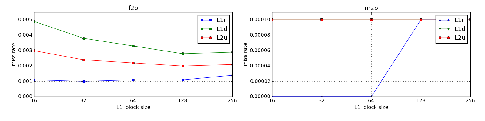
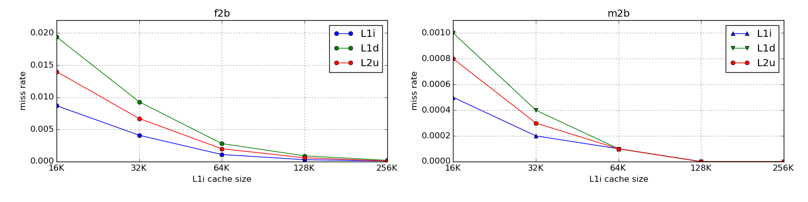
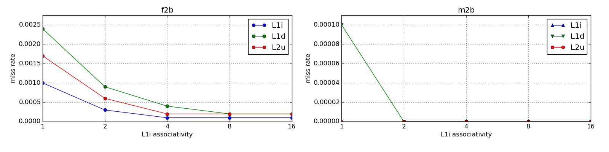
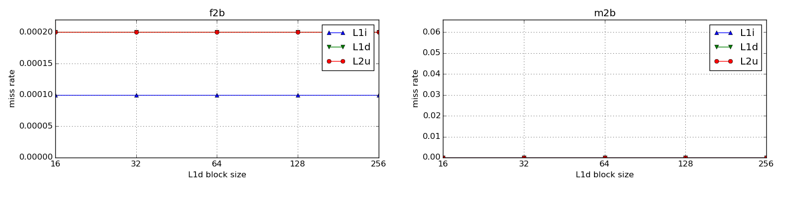
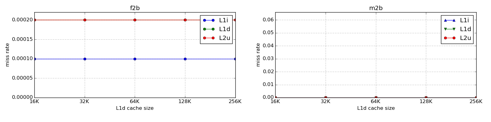
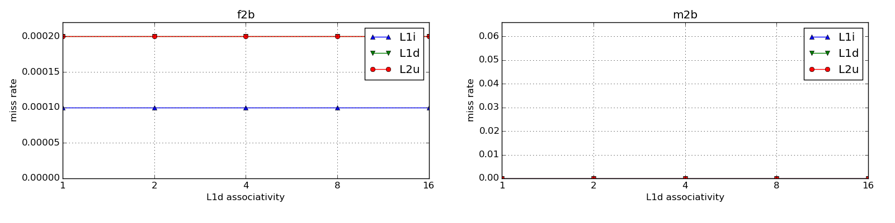
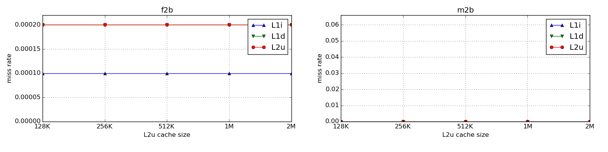

### Exercício 2: Configuração de Cache
#### 033324 - Yugo Kuno

---

Para avaliar a melhor configuração de cache para um programa, foram simuladas com o software [dinero](http://www.cs.wisc.edu/~markhill/DineroIV/) as operações de cache do `gcc` a partir dos traces 176.gcc.f2b e 176.gcc.m2b disponíveis na rede do IC sob o path _~lucas/mc723/traces_.  
O `gcc` foi escolhido por ser um programa particularmente relevante, especialmente para a área de desenvolvimento, em que os tempos de compilação podem ser críticos para grandes projetos.

Antes de mais nada foram avaliadas as políticas de _replacement_, _fetch_, _write allocate_ e _write back_.  
Com esse objetivo, os parâmetros iniciais das _caches_ foram escolhidos a partir das configurações de L1 e L2 de um _core_ da CPU _AMD Phenom II X4 955 Black Edition_:

|Cache|Cache size|Block size|Associativity|
|---|---|---|---|
|L1i (L1 instruction)|64K|64|2|
|L1d (L1 data)|64K|64|2|
|L2u (L2 unified)|512K|64|16|

### Avaliação de _replacement policy_

|trname|Parameter|Miss rate L1i|Miss rate L1d|Miss rate L2u|
|---|---|---|---|---|
|gcc_f2b|repl=l|0.0024|0.0078|0.0886|
|gcc_f2b|repl=f|0.0026|0.0084|0.0969|
|gcc_f2b|repl=r|0.0025|0.0086|0.1076|
|gcc_m2b|repl=l|0.0001|0.0374|0.3361|
|gcc_m2b|repl=f|0.0001|0.0374|0.3437|
|gcc_m2b|repl=r|0.0001|0.0376|0.0995|

(l=LRU, f=FIFO, r=random)

Percebe-se que a política _Least Recently Used_ obteve os melhores resultados tanto em _f2b_ quanto em _m2b_, tal que ela é a escolhida pelo resto desta avaliação.

### Avaliação de _fetch policy_

|trname|parameter|miss rate L1i|miss rate L1d|miss rate L2u|
|---|---|---|---|---|
|gcc_f2b|fetch=d|0.0024|0.0078|0.0886|
|gcc_f2b|fetch=a|0.0011|0.0033|0.0022|
|gcc_f2b|fetch=m|0.0017|0.8246|0.0031|
|gcc_f2b|fetch=t|0.0013|0.7843|0.0036|
|gcc_f2b|fetch=l|0.0024|0.0000|0.0024|
|gcc_m2b|fetch=d|0.0001|0.0374|0.3361|
|gcc_m2b|fetch=a|0.0000|0.0001|0.0001|
|gcc_m2b|fetch=m|0.0001|0.7202|0.0001|
|gcc_m2b|fetch=t|0.0001|0.6658|0.0001|
|gcc_m2b|fetch=l|0.0001|0.0000|0.0001|

(d=demand, a=always, m=miss, t=tagged, l=load forward, s=subblock)

O parâmetro _subblock_ não foi utilizado já que esta configuração de cache não foi utilizada (default: `block size`) e não teria utilidade na avaliação de _fetch_.
Percebe-se que a políticas _always_ e _load forward_ obtiveram resultados acima das outras e muito parecidos; como _always_ tem melhor desempenho em mais resultados de _f2b_ e _m2b, ela foi escolhida para o resto desta avaliação.

### Avaliação de _write allocate policy_ e _write back policy_

|trname|parameter|miss rate L1i|miss rate L1d|miss rate L2u|
|---|---|---|---|---|
|gcc_f2b|walloc=a|0.0011|0.0033|0.0022|
|gcc_f2b|walloc=n|0.0011|0.0033|0.0022|
|gcc_f2b|walloc=f|0.0011|0.0033|0.0022|
|gcc_m2b|walloc=a|0.0000|0.0001|0.0001|
|gcc_m2b|walloc=n|0.0000|0.0001|0.0001|
|gcc_m2b|walloc=f|0.0000|0.0001|0.0001|

|trname|parameter|miss rate L1i|miss rate L1d|miss rate L2u|
|---|---|---|---|---|
|gcc_f2b|wback=a|0.0011|0.0033|0.0022|
|gcc_f2b|wback=n|0.0011|0.0033|0.0022|
|gcc_f2b|wback=f|0.0011|0.0033|0.0022|
|gcc_m2b|wback=a|0.0000|0.0001|0.0001|
|gcc_m2b|wback=n|0.0000|0.0001|0.0001|
|gcc_m2b|wback=f|0.0000|0.0001|0.0001|

(a=always, n=never, f=nofetch)

É claro que alterar estas políticas não afetaram o _miss rate_ de nenhuma das caches; a partir daqui a política usada será a de _always_.

### Avaliação de _L1 instruction block size_

[data](l1ibsize.md)

O aumento do _miss rate_ de L1i é muito pequeno entre 32 e 128, enquanto os referentes a L1d e L2u continuam caindo em `f2b`; logo se escolhe um _block size_ de 128 para L1i a partir deste ponto.

### Avaliação de _L1 instruction cache size_

[data](l1isize.md)

O decréscimo do _miss rate_ parece ser percentualmente constante ao longo da curva, o que obviamente não reflete a latência de busca dos ítens em _cache_ que cresce conforme o tamanho do mesmo aumenta; esta é uma das razões para os tamanhos de cache mais recentes não terem mudado significativamente. Desta forma faz-se uma escolha conservadora em não escolher um tamanho de _L1 instruction cache_ superior a 128K, considerando a redução marginal do _miss rate_, inferior a 0.02% em todos os casos.

### Avaliação de _L1 instruction associativity_

[data](l1iassoc.md)

O aumento de _associativity_ dá retornos positivos até o valor 8, tal que se define esta associatividade para todos os testes abaixo.

### Avaliação dos parâmetros _block size_, _cache size_ e _associativity_ de _L1 data_ e _L2 unified_ 

[data](l1dbsize.md)

[data](l1dsize.md)

[data](l1dassoc.md)

[data](l2ubsize.md)

[data](l2usize.md)

[data](l2uassoc.md)

Não há qualquer alteração nos _miss rates_ de _L1 data_ ou de _L2 unified_ após as alterações feitas em _L1 instruction_, tal que decide-se que os mesmos não terão suas configurações alteradas dos valores iniciais do início deste relatório.

### Conclusão

O uso do `gcc` tem _miss rate_ estabilizado em todas as caches para valores menores ou iguais a 0.02% tanto para _f2b_ quanto para _m2b_.  
Assim chega-se a conclusão que, para o uso **específico** deste programa e nas mesmas condições do trace realizado, não é necessário alterar mais do que a _L1 instruction_ e definir as políticas de _replacement_, _fetch_, _write allocate_ e _write back_.  
Logo a configuração final fica:

|Policy|Parameter|
|---|---|
|Replacement|LRU|
|Fetch|always|
|Write allocate|always|
|Write back|always|

|Cache|Cache size|Block size|Associativity|
|---|---|---|---|
|L1i (L1 instruction)|128K|128|8|
|L1d (L1 data)|64K|64|2|
|L2u (L2 unified)|512K|64|16|
