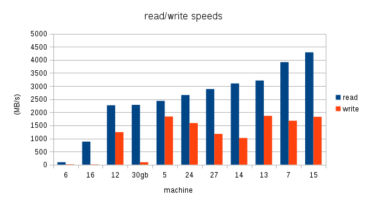
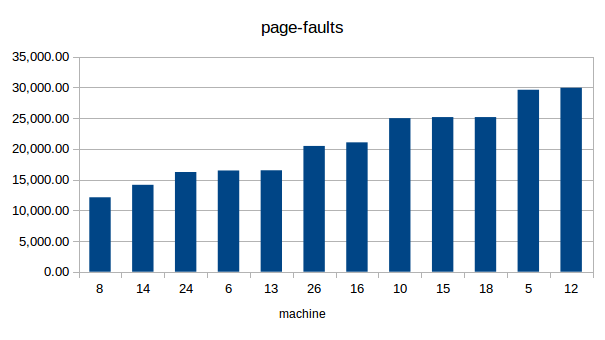
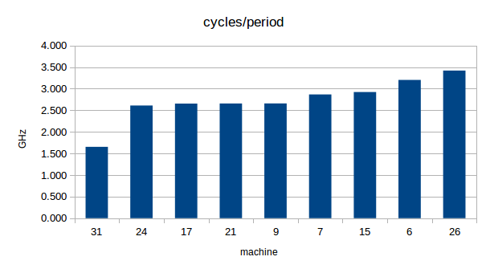

### Projeto 1, parte 3
### Avaliação dos benchmarks realizados
#### 033324 - Yugo Kuno

---

### Avaliação geral de tempo entre os 8 benchmarks

Como diversos benchmarks diferentes foram realizados, existem múltiplos parâmetros avaliados que variam de benchmark para benchmark; além disso em média cada máquina passou por apenas 3 das 8 opções de benchmark possíveis.  
Assim torna-se necessário limitar o escopo de avaliação das máquinas, escolhendo-se alguns critérios de avaliação fundamentais. Obviamente o tempo de execução é um dos mais importantes a serem avaliados.  

Entretanto, mesmo essa medida aparentemente simples pode ter significados diferentes entre as opções de avaliação e com relação a qual parte da máquina está sendo avaliada.  
Por exemplo, muitos grupos não apresentaram o melhor tempo de execução, escolhendo apresentar apenas o tempo médio; outros entendem que o tempo médio pode ser fortemente afetado pelo load da máquina devido a outros processos em execução, tal que a melhor medida é o menor tempo.  
Outro exemplo é qual parte da máquina afeta mais significativamente o benchmark em questão (qual o _bottleneck_): a performance da CPU ou da GPU? Talvez o maior atraso seja devido ao barramento devido à comunicação de dados inerente ao benchmark?  

Apesar de todas essas preocupações serem válidas, este relatório tornaria-se excessivamente longo caso cada possibilidade fosse avaliada. Assim, para a mensuração de performance da máquina em relação ao tempo de execução, de cada benchmark foi escolhida uma medida de tempo, o menor tempo, onde disponível: os desvios de tempo disponíveis mostraram-se geralmente pequenos de maneira geral.  
Também espera-se que as máquinas tenham desempenho de CPU/GPU/barramento/etc compatíveis, tal que um alto desempenho de CPU corresponda a um bom desempenho de GPU, por exemplo.  
Como os tempos de cada benchmark variam significativamente, para que se pudesse compor um score comparável entre diferentes benchmarks, o tempo de execução pela máquina foi dividido pela média de tempo daquele benchmark, tal que *as melhores máquinas tem o menor score*. Para que se possa então utilizar esses scores de diferentes benchmarks, para cada máquina o score final de tempo foi calculado como a média dos scores em cada benchmark; além disso máquinas com menos de 3 medidas foram consideradas sub-avaliadas e não participaram do _ranking_ das máquinas mais rápidas.

Assim a fórmula de score de tempo para cada máquina ficou:  
[2 < (número de participações em benchmarks)] · {Σ [(nota em benchmark) / (média do benchmark)]} / (número de participações em benchmarks)

A planilha de avaliação completa pode ser encontrada [aqui](./time_evaluation.ods). Segue abaixo a planilha de classificação (sem as máquinas desclassificadas por terem passado por menos de 3 benchmarks).

|machine|name|description|# of benchmarks|final score|position| 
|---|---|---|---|---|---| 
|17|IC301-Titan|Intel® Core™2 Quad CPU Q8400 @ 2.66GHz × 4 Intel® Q45/Q43, 3.8GB RAM|3|0.32|1| 
|22|Pedro Grijó|Intel(R) Core(TM) i7-2670QM CPU @ 2.20GHz x4, 8GB DDR 1333Mhz ,Ubuntu 14.04LTS 32bits,HDD: SAMSUNG HN-M101MBB / 5400 RPM/ Sata III|3|0.33|2| 
|15|Gabriel Magalhães|Intel® Core™ i7-3612QM CPU @ 2.10GHz × 8; Memory 8GB, SSD Kingston 240GB V300 Sata III;  Ubuntu 15.04 |6|0.36|3| 
|20|Rodrigo Silva|Intel(R) Core(TM) i5-2450M @ 2.5GHZ; Memory 6GB|3|0.39|4| 
|25|Matheus Figueiredo|Intel Core i7-4700HQ CPU @ 2.4GHz, 16GB DDR3, Ubuntu 14.04LTS, HDD 5400RPM|3|0.42|5| 
|18|João Fidélis|Intel Core i7-Intel(R) Core(TM) i7-4700HQ CPU @ 2.40GHz x 4, 16GB DDR3, Ubuntu 14.04LTS, HD: WD10S21X-24R1BTO / 7200RPM / Sata III|3|0.42|6| 
|4|Pedro Meireles|Intel® Core™ i5-4590 CPU @ 3.30GHz × 4;  Memory 8 GiB;  64-bit graph: Intel® Haswell Desktop , Gnome: Version 3.18.2; Disk 216.9 GB; Fedora 23|3|0.46|7| 
|12|debios| Intel(R) Core(TM) i7-3612QM CPU @ 2.10GHz x 4, 8 threads, 8GB, 64-bit, SSD 32GB, HDD1TB (5400rpm), Debian|3|0.51|8| 
|7|Cygnus X-1|Intel® Core™ i7 × 4;  Memory 8 GiB;  |3|0.54|9| 
|10|Renan Gomes|Intel® Core™ i7-4702MQ CPU @ 2.20GHz × 8 (64 bits) Memory 8 GiB; Graphics Intel® Haswell Mobile ; Ubuntu 14.04|3|0.56|10| 
|5|Klaus Rollman|Intel(R) Core(TM) i7-3610QM CPU 4 cores, 8 threads @ 2.30GHz @ L1 256 KB / L2 1024 KB / L3 6144 KB|3|0.61|11| 
|13|Gabriel Bueno|Intel(R) Core(TM) i7-4510U CPU @ 2.00GHz x 2, 4 threads, 64-bit; Memory 8 GB DDR3; HD SATA 5400rpm;Ubuntu  15.10|3|0.68|12| 
|24|Wendrey|Intel Core i5-5200U CPU 2.20GHz x 4 L1 32KiB L2 256KiB L3 3MiB Memory 8GiB DDR3 Disk 1TB WDC WD10JPVX-22J Ubuntu 14.04 LTS|3|0.72|13| 
|6|yk0 - Yugo Kuno|AMD PhenonII, 4 cores, 3.2MHz; 10GB, ddr3, 1.333 MHz; hdd sata3, 7200rpm, 32MB buffer|3|0.81|14| 
|31|Netbook - Felipe Emos|Intel Atom Processor D4xx/D5xx/N4xx/N5xx DMI Bridge|3|1.08|15| 
|11|Bruno Hori - Mamonas|Intel(R) Core(TM)2 Quad CPU    Q8400  @ 2.66GHz|4|1.14|16| 
|14|Renan Castro|Intel(R) Core(TM) i7-3740QM CPU @ 2.70GHz @ 2 CORES @ Virtual Machine|3|1.26|17| 
|8|Luiz Sekijima|Intel® Core™2 Duo CPU T6500 @ 2.10GHz × 2, 4GB RAM|3|1.34|18| 
|16|Victor Souza|Intel(R) Core(TM)2 Quad CPU Q8400  @ 2.66GHz; Memory 4GB, Fedora release 21|3|2.76|19| 
|3|Mateus Ruivo|Intel(R) Core(TM) i3-3110M CPU @ 2.40GHz 3072 KB Cache, 4GB RAM DDR3, 5400rpm SATA|3|5.47|20| 
|23|Pedro Vasconcellos|Raspberry Pi, 900MHz quad-core ARM Cortex-A7 CPU, 1GB RAM, 32GB SD Card|3|5.87|21| 

Percebe-se que existem grupos de scores muito próximos, o que reflete às máquinas atuais serem bastante parecidas, sendo o maior divisor a época do seu projeto.  
Os Intel i7 e i5 tem desempenhos superiores, estando o AMD no fim deste grupo; abaixo os Intel Atom, Core 2 e Core Duo ficam claramente separadas no grupo inferior; por fim o Raspberry Pi fica por último, como esperado.  
Parece surpreendente que um i7 esteja no grupo de baixo (17ª posição), mas o mesmo ocorre porque o benchmark foi realizado em uma máquina virtual na mesma.  
É claro que o processador não é o único determinante dos tempos de execução como já foi mencionado, mas percebe-se que a qualidade dos outros componentes das máquinas tende a acompanhar a geração do processador no universo avaliado.

---

### Avaliação de leitura e escrita em dispositivo de armazenamento utilizando o benchmark 3, "convolução"

Como é de se esperar, a máquina com SSD tem as melhores performances nestes quesitos.  
Entretanto é difícil avaliar parte das máquinas por muitas descrições não detalharem qual o dispositivo de armazenamento utilizado, ou possuírem dois dispositivos e não ser possível determinar qual o dispositivo usado nos testes de leitura e escrita.

Dois fatos curiosos chamam bastante a atenção:  
1- a máquina 14 tem um dos melhores desempenhos apesar de ser um ambiente virtualizado; devido ao tamanho limitado dos arquivos eles tenham sido "armazenados" somente no dispositivo virtual, sem sair da memória RAM da máquina _host_?
2- a máquina 6, do próprio autor, apesar de ter um dispositivo de armazenamento não excessivamente antigo, teve uma queda particularmente significativa de performance após algumas rodadas de testes, o que sugere que haja algum fator não conhecido interferindo com a medida.

---

### Avaliação de _page-faults_ utilizando o benchmark 2, "ffmpeg"

Aqui observa-se que algumas das máquinas consideradas ultrapassadas tiveram um número comparativamente pequeno de _page-faults_, enquanto algumas das mais novas obtiveram os maiores números. Esta é outra medida difícil de se atribuir a configuração das máquinas, mesmo porque dependendo do _load_ da máquina no momento da medida, etc, a memória disponível para _cache_ pode estar bastante restrita.

---

### Avaliação de _cycles/s_ utilizando o benchmark 6, "imagemagick"

Este benchmark traz alguns problemas:  
1- A ordem dos arquivos a serem avaliados não é bem definida, como percebe-se claramente que algumas pessoas não seguiram a ordem da maioria e as medidas são inconsistentes entre as medidas de número "#1" a "#4" entre diferentes máquinas.  
2- As medidas de _task-clock_, _cycles_ e _instructions_ não retornam estes próprios valores, mas sim o equivalente em CPUs, _cycles/period_ e _IPC_, respectivamente.

Ainda assim é possível utilizar a medida de _cycles/period_ para avaliar o desempenho dos processadores, como abaixo:  

Do gráfico percebe-se como o Intel Atom perde no quesito frequência comparado a outras máquinas, enquanto processadores mais antigos como os da máquina 6 e 26 tem desempenhos melhores; isso é claro está relacionado a boa parte das medidas com máquinas mais modernas terem sido feitas com laptops, nos quais a preocupação com consumo de energia limita o clock dos processadores.
